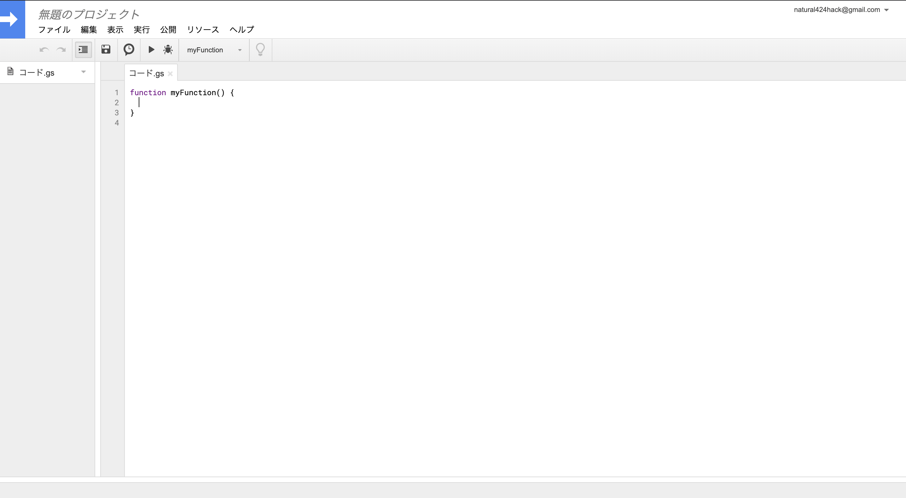
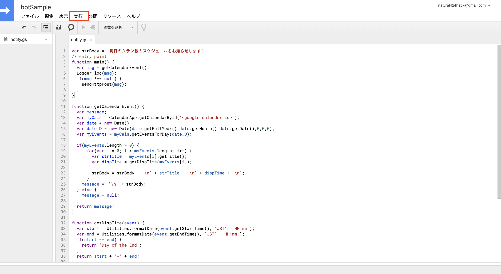

## LINE通知アプリケーションの使い方

### 手順

- [ ] 1.Google Spread Sheetを作成する。

- [ ] 2.Google Spread Sheetの「ツール」→「スクリプト エディタ」でGASを記述できる状態にする。

 

- [ ] 3.notify.gsのソースコードをコピーしエディタにペーストする

- [ ] 4.スクリプトのカスタマイズを行う

 - 4-1 通知メッセージのヘッダー作成を行う

   **L 1**

   ```
   var strBody = '<通知メッセージのヘッダーとして表示する文字列を記述>';
   ```

   サンプル

   ```
   var strBody = '明日のクラン戦のスケジュールをお知らせします';
   ```

 - 4-2 スケジュール連携を行うためのカレンダーIDを以下にサイトを参照して入手

   [Google Calender IDの入手方法](http://www.sukicomi.net/2018/07/google-calendarid.html)

   上記サイトで入手したカレンダーid(gmail)をセットする

   **L 13**

   ```
   var myCals = CalendarApp.getCalendarById('<google calender id>');
   ```

   サンプル
   ```
   var myCals = CalendarApp.getCalendarById('reosakurai424@gmail.com');
   ```

 - 4-3 LINE Notify のAPI Tokenを以下のサイトを参照し入手する

   [LINE Notify API Tokenの取得方法 ](https://qiita.com/iitenkida7/items/576a8226ba6584864d95)

   **L 43**

   ```
   var token = '<LINE Notify API TOKEN creds>';
   ```

- [ ] 5.スクリプトの実行を行う

  
