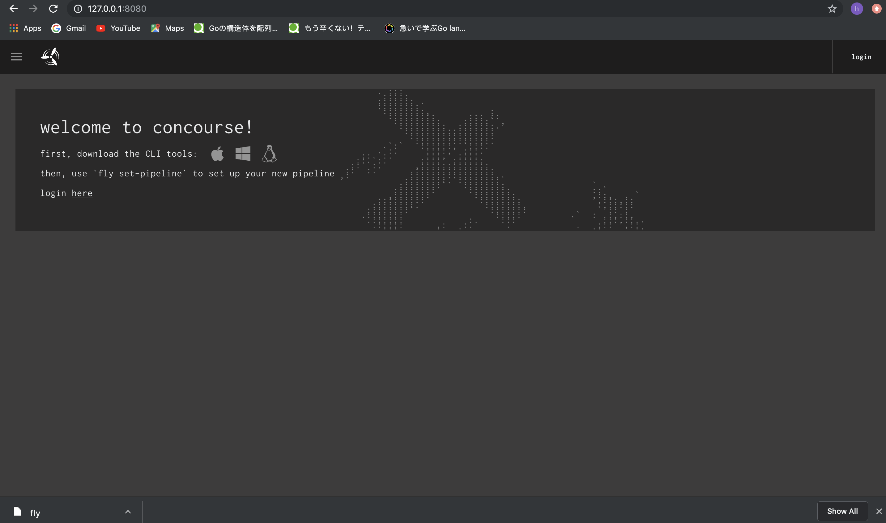
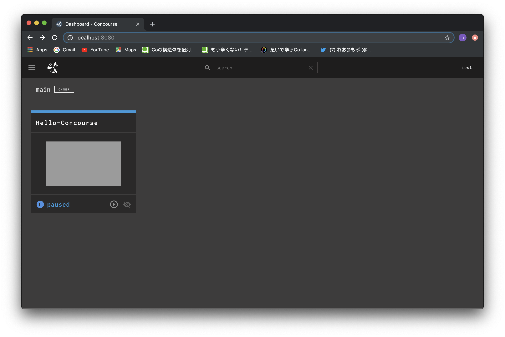

## *Concourse Set Up Manual*

- [ ] ***set up Concourse with Docker-Compose***

  *[install Desktop for Mac](https://docs.docker.com/) and exec docker app*

  *deploy local concourse*

  ```
  $ # Download docker-compose.yml from https://concourse-ci.org/docker-compose.yml
  $ curl -O https://concourse-ci.org/docker-compose.yml
  ```

  ```
  $ # Deploy Concourse with docker-compose
  $ docker-compose up -d
  ```

- [ ] ***Access to Concourse UI and get Fly Binary***

  `http://127.0.0.1:8080/`

  

- [ ] ***Ready to use at Fly CLI***

  ```
  $ mv ~/Download/fly /usr/local/bin/fly
  $ chmod 755 /usr/local/bin/fly
  ```

- [ ] ***Fly Login***

  `fly --target <Target-name> login --concourse-url <Concourse-Deploy-URL> -u <User> -p <Pass> `
  
  ```
  fly --target tutorial login --concourse-url http://127.0.0.1:8080 -u test -p test
  ```

- [ ] ***Check target***

  ```
  $ fly targets
  name      url                    team  expiry
  tutorial  http://127.0.0.1:8080  main  Mon, 22 Jul 2019 07:14:10 UTC
  ```
- [ ] ***Sync my target to Concourse Server***

  ```
  $ fly --target <Target-Name> sync
  ```

- [ ] ***Check Concourse API in local file***

  ```
  cat ~/.flyrc
  targets:
    tutorial:
      api: http://127.0.0.1:8080
      team: main
      token:
        type: Bearer
        value: <Mask Credential info>
  ```
 
- [ ] ***Set Sample Pipeline***

  *get Sample [pipeline.yml](  https://github.com/starkandwayne/concourse-tutorial/blob/master/tutorials/basic/basic-pipeline/pipeline.yml
) from GitHib*

  ```
  cat pipeline.yml
  ---
  jobs:
    - name: job-hello-world
      public: true
      plan:
        - task: hello-world
          config:
            platform: linux
            image_resource:
              type: docker-image
              source: {repository: busybox}
            run:
              path: echo
              args: [hello world]
              
  ```

  *setPipeline*

  ```
  fly -t tutorial set-pipeline --pipeline Hello-Concourse --config ./concourse_opt/pipeline.yml
  jobs:
    job job-hello-world has been added:
  + name: job-hello-world
  + public: true
  + plan:
  + - task: hello-world
  +   config:
  +     platform: linux
  +     image_resource:
  +       type: docker-image
  +       source:
  +         repository: busybox
  +     run:
  +       path: echo
  +       args:
  +       - hello world

  apply configuration? [yN]: y
  pipeline created!
  you can view your pipeline here: http://127.0.0.1:8080/teams/main/pipelines/Hello-Concourse

  the pipeline is currently paused. to unpause, either:
    - run the unpause-pipeline command:
      fly -t tutorial unpause-pipeline -p Hello-Concourse
    - click play next to the pipeline in the web ui  
  ```

  `http://127.0.0.1:8080/teams/main/pipelines/Hello-Concourse`

  

  
